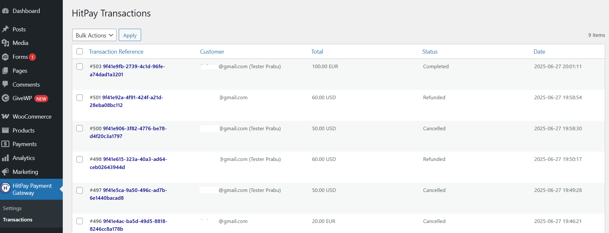

# HitPay 

=== HitPay Payment Gateway for WordPress ===
Contributors: HitPay
Tags: hitpay, payment gateway, woocommerce, QR code
Requires at least: 4.0
Tested up to: 6.8
Stable tag: 4.1.9
Requires PHP: 5.5
WC requires at least: 2.4
WC tested up to: 9.8.1
License: MIT

HitPay Payment Gateway Plugin allows HitPay merchants to accept PayNow QR, Cards, Apple Pay, Google Pay, WeChatPay, AliPay and GrabPay Payments.

== Description ==

HitPay Payment Gateway Plugin allows HitPay merchants to accept PayNow QR, Cards, Apple Pay, Google Pay, WeChatPay, AliPay and GrabPay Payments.

This plugin would communicate with 3rd party HitPay payment gateway(https://www.hitpayapp.com/) in order to process the payments.

Merchant must create an account with HitPay payment gateway(https://www.hitpayapp.com/).

Pay only per transaction. No monthly, setup, admin or any hidden service fees.

Merchant once created an account with HitPay payment gateway(https://www.hitpayapp.com/), they can go to thier HitPay dashboard and choose the payment options they would to avail for their site.

And merchant need to copy the API keys and Salt values from the HitPay Web Dashboard under Settings > Payment Gateway > API Keys

== Installation ==

= Using The WordPress Dashboard =

1. Navigate to the 'Add New' in the plugins dashboard
2. Search for 'HitPay Payment Gateway for WordPress'
3. Click 'Install Now'
4. Activate the plugin on the Plugin dashboard

= Uploading in WordPress Dashboard =

1. Navigate to the 'Add New' in the plugins dashboard
2. Navigate to the 'Upload' area
3. Select `hitpay-payment-gateway-for-wordpress.zip` from your computer
4. Click 'Install Now'
5. Activate the plugin in the Plugin dashboard

= Using FTP =

1. Download `hitpay-payment-gateway-for-wordpress.zip`
2. Extract the `hitpay-payment-gateway-for-wordpress` directory to your computer
3. Upload the `hitpay-payment-gateway-for-wordpress` directory to the `/wp-content/plugins/` directory
4. Activate the plugin in the Plugin dashboard

= Updating =

Automatic updates should work like a charm; as always though, ensure you backup your site just in case.

== Configuration ==

1. Go to HitPay Payment Gateway => Settings
2. Active: Enable/Disable this payment option
3. Pay Button Text: If button text is not provided in the short code, this default button text will be used.(for example: "HitPay or Creditcard or PayNow")
4. Live: Enable payments in live mode
5. Copy the API keys and Salt values from the HitPay Web Dashboard under Settings > Payment Gateway > API Keys
6. Currency: If currency is not provided in the short code, this default currency will be used.
7. Click "Save Changes"


== Usage ==

= Shortcode =

Insert the shortcode anywhere on your page or post that you want the form to be displayed to the user.

1. Basic: For the below code, requires the user to enter amount and email to complete payment, default button text and currency will be used.
```
[hitpay-paynow-button]
```

2. With button text: For the below code, requires the user to enter amount and email to complete payment, provided button text and default currency will be used.
```
[hitpay-paynow-button]HitPay Cards[/hitpay-paynow-button]
```

3. With attributes: email or use_current_user_email with value "yes", amount.
```
[hitpay-paynow-button amount=100 email="customer@email.com" ]

or

[hitpay-paynow-button amount=100 use_current_user_email="yes" ]
```

4. With attributes email, amount and currency with button text:
```
[hitpay-paynow-button amount=100 email="customer@email.com" currency=EUR ]HitPay Cards[/hitpay-paynow-button]
```


== Payment Forms ==

```[hitpay-paynow-button amount=100 currency=EUR ]HitPay Cards[/hitpay-paynow-button]```


```[hitpay-paynow-button]PayNow and Cards[/hitpay-paynow-button]```


== Manage Payment Transactions ==
1. Go to HitPay Payment Gateway => Transactions
2. Click view link to Transaction details
3. Admin can change the payment status



== Refund ==
1. Go to HitPay Payment Gateway => Transactions
2. Click view link to Transaction details
3. Enter the amount and click refund button


== Frequently Asked Questions ==

= Do I need an API key? =

Yes. You can copy the API keys and Salt values from the HitPay Web Dashboard under Settings > Payment Gateway > API Keys.

= Where can I find more documentation on your service? =

You can find more documentation about our service on our [get started](https://hitpay.zendesk.com/hc/en-us/sections/360002421091-About-HitPay) page, our [technical documentation](https://hitpay.zendesk.com/hc/en-us/articles/900004225243-HitPay-WooCommerce-Payment-Gateway-Singapore-How-to-update-the-HitPay-WooCommerce-Plugin-) page or our [resources](https://hit-pay.com/docs.html) page.
If there's anything else you need that is not covered on those pages, please get in touch with us, we're here to help you!

= Where can I get support? =

The easiest and fastest way is via our live chat on our [website](https://www.hitpayapp.com/) or via our [contact form](https://www.hitpayapp.com/contactus).

== Screenshots ==

1. The settings panel used to configure the gateway.
2. Shortcode usuage.
3. Payment form rendered for this code: ```[hitpay-paynow-button amount=100 currency=EUR ]HitPay Cards[/hitpay-paynow-button]```
4. Payment form rendered for this code: ```[hitpay-paynow-button]PayNow and Cards[/hitpay-paynow-button]```
5. Transactions List
6. Transaction Details

== Changelog ==

= 1.0.0 =
* Jul 01, 2025
* Applied Plugin Check (PCP) Recemmendations for the latest version 1.5.0
* Plugin tested on WordPress 6.8.1
* Initial release.